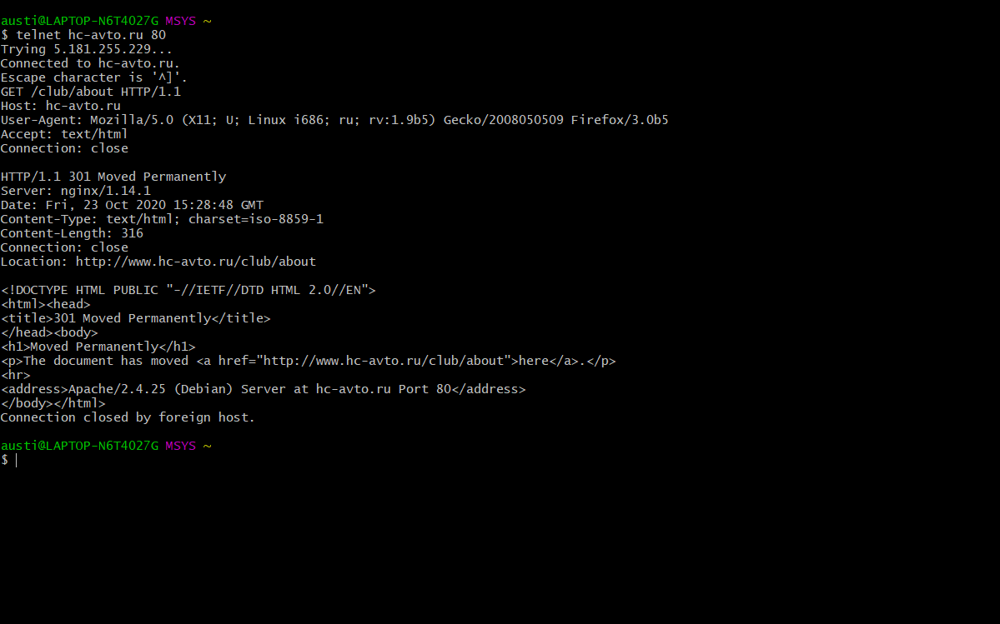

# second

В данном примере было произведено подключение к сайту hc-avto.ru
В заголовках мы указали, что нужны текстовые данные (а также исходный код) и что мы хотим закрыть соединение после ответа

В итоге был получен 301 статус-код, означающий, что данная страница была перманентно перемещена
